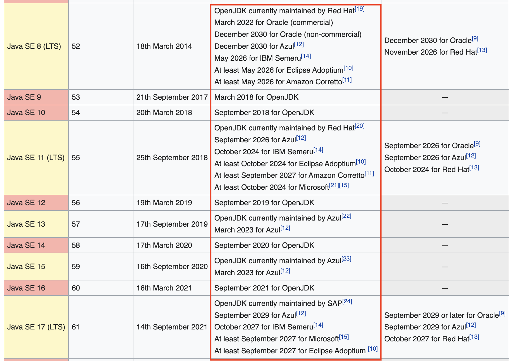

## 들어가기에 앞서

---
### 별다른 이유없이 똑같은 JDK 를 사용하고 있다면

어떤 JDK 가 있는지 관심이 없다면 처음에 우연히 접한 JDK 만을 사용하게 됩니다. 내가 사용하고 있는 JDK 가 어떤 장점이 있는지 모른다면 이번 기회에 어떤 JDK 가 있는지, 어떤 기준에 따라 선택하는게 좋은지 알아보고자 합니다.

## java 버전 선택하기

---
### 8 미만의 버전은 메리트가 없다

8 미만의 java 버전은 22년도 기준 지원이 모드 끝났을 뿐 아니라 해당 버전을 지원하는 라이브러리의 보안 취약점을 해결하기가 어렵습니다.

여러 이슈가 해결된 라이브러리와 프레임워크는 1.8(8) 버전 이상을 지원하는 경우가 많기 때문에 특별한 이유가 없다면 최소 8, 혹은 그 이상의 버전을 선택할 수 있도록 합니다.

### LTS 가 적힌 버전 중에서 고려할 것

지원 기간은 아주 중요하기 때문에 Long Term Support(이하 LTS) 버전을 선택하는 것이 정석입니다. jdk 19 까지 나온 상황에서 LTS 버전은 8, 11, 17 이므로 이 중에서 선택하는 것이 좋습니다.

### 프로젝트 환경에 따라 버전 선택

본인의 프로젝트 환경에서 사용하는 라이브러리와 프레임워크를 확인하고 지원하는 버전에 따라 선택합니다. 새로운 프로젝트라면 가장 최신의 LTS 버전을 사용하는 것을 추천드립니다.

## JDK 선택하기

---

### TCK 여부로 배급처를 선택

OpenJDK 는 Oracle 에서 제공하는 OpenJDK 말고도 다양한 배급처가 존재합니다.
여러 배급처에서 제공하는 OpenJDK 중 Technology Compatibilty Kit(이하 TCK)로 검증된 OpenJDK 는 호환성과 안정성에 대한 걱정은 안해도 되며 각 배급처별 OpenJDK 의 성능은 대동소이한 수준입니다.
대부분의 OpenJDK 는 TCK 인증을 거쳤으나 관례적으로 확인할 필요는 있습니다.

대표적인 TCK 를 거친 OpenJDK 로는 OpenJDK, ZuluJDK, TemurinJDK 등이 있습니다.

### Cloud 환경에 따라 배급처 고려

만약 AWS 환경에서 서비스를 한다면 amazon에서 제공하는 Corretto 를 선택하는 것도 방법입니다. 다만 AWS 환경에서 다른 OpenJDK 때 보다 더 나은 차이를 경험해본 적은 없습니다.
이 처럼 Cloud 환경에서 제공하는 JDK 가 있다면 정량적 지표나 개인적인 경험에 따라 고려하면 될 것 같습니다.

### 지원 기간을 고려

같은 LTS 버전이라 할지라도 배급처에 따라 지원 기간이 상이하므로 기간을 살펴보는 것이 중요합니다.

지원 기간은 대체로 zulu(Azul)이 가장 길다 [java version history - Wikipedia]

## 결론

---

### 8 은 Zulu 를 11 이상은 Temrin 을 사용하는건 어떨까

버전이 올라갈 수록 새로운 기능이 존재하고 많은 부분이 개선됩니다. 맹목적으로 JDK 8을 사용하는 것 보단 프로젝트 환경이 허락하는 범위 내에서 가장 최신의 JDK 버전을 쓰는 것이 좋으며 LTS 버전은 선택이 아니라 필수라고 생각합니다. 이유야 여러가지가 있지만 제가 사용하는 버전 별 JDK와 간단한 이유는 다음과 같습니다.
| JDK Version | 배급처 | 이유 |
| --- | --- | ---|
| 8 | Zulu | 신뢰성이 높고 지원기간이 압도적으로 김(~2030) |
| 11 이상 | Temurin | 이클립스 재단의 Adoptium 에서 이전되었으며 최근에 가장 핫함 |

매우 주관적이며 더 좋은 대안을 알게되거나 알려주신다면 바뀌지 않을까 싶습니다.

## 참고 및 출처

---

[java version history](https://en.wikipedia.org/wiki/Java_version_history)

[openjdk wikipeida](https://en.wikipedia.org/wiki/OpenJDK)

[amazon corretto openjdk](https://aws.amazon.com/ko/corretto/?filtered-posts.sort-by=item.additionalFields.createdDate&filtered-posts.sort-order=desc)

[LINE의 OpenJDK 적용기](https://engineering.linecorp.com/en/blog/line-open-jdk/)