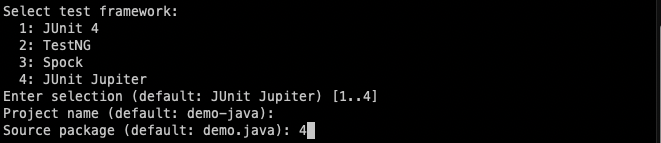
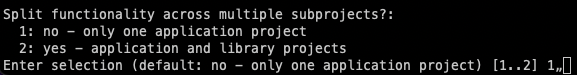

## 작성 환경

---

- OS: Mac Monterey

## 사전 준비

---

### Gradle 설치

## Gralde 프로젝트 시작하기

---

### 1.프로젝트 시작 폴더 생성

Gradle 프로젝트를 생성하기 전에 해당 프로젝트를 시작할 폴더를 새로 만듭니다. 폴더 명과 별개로 프로젝트 이름은 따로 설정할 수 있습니다. 방법은 아래 말씀드리겠습니다.

```bash
 ex) mkdir 프로젝트_폴더_이름
 
 mkdir demo-java
```

파일을 만들었으면 해당 폴더로 이동합니다.

### 2.Gradle 프로젝트 생성

새롭게 생성한 폴더를 Gradle 프로젝트로 만드는데에는 몇 가지 요소를 선택해야합니다.

```bash
  gradle init
```


생성하고자 하는 프로젝트의 타입을 선택합니다. 저는 이번에 2, "application"을 선택하여 진행하겠습니다.


다음은 프로젝트의 언어를 선택합니다. 저는 이번에 "java"를 선택하겠습니다.


다음은 script DSL을 선택합니다. 저는 이번에 "groovy"를 선택하겠습니다.



다음은 테스트 프레임워크를 선택합니다. 선택할 수 있는 테스트 프레임워크는 여러개가 존재하지만 저는 이번에 "junit jufiter"를 선택하겠습니다.



다음은 프로젝트 명을 입력합니다. 디폴트 값은 폴더의 이름을 따라가지만 다른 프로젝트 명을 입력할 수도 있습니다.

설정을 전부 끝마쳤다면 설정한 옵션에 맞춰 Gradle 프로젝트가 생성됩니다.
