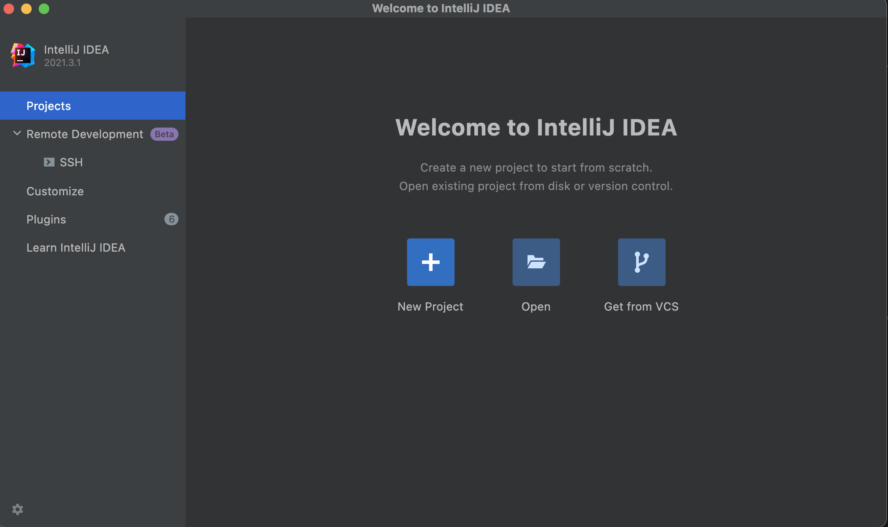
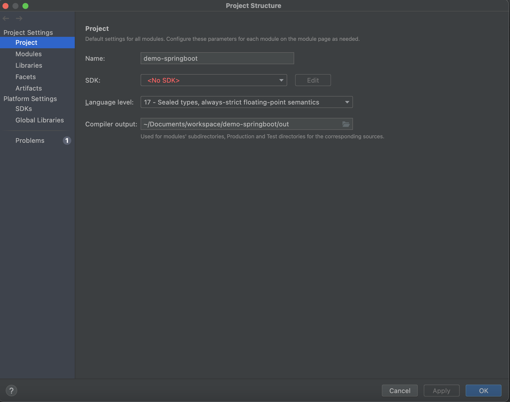

Spring Boot를 이용하여 새로운 프로젝트를 만들어보도록 하겠습니다.

## 환경

---

- OS: MacOS 12.1(Monterey)
- IDE: Intellij(2021.2)
- language: java 17
- project: Gradle project

## 프로젝트 생성

---

### spring initializr을 이용한 프로젝트 생성

새로운 springboot project를 시작하는 방법은 여러가지가 있지만 이번에는 spring inializr에 접속하여 간단하게 생성해보도록 하겠습니다.

1. [Spring initializr](https://start.spring.io/) 사이트에 접속합니다.

2. Project 환경 선택

- Projrect: Gradle Proejct
- Language: Java
- Spring Boot: 2.6.2
- Packaging: Jar
- Java: 17

Project Metadata는 각 프로젝트 성격에 맞춰서 작성하면 됩니다.

Dependencies는 우측 __Add Dependencies__ 버튼을 클릭하여 추가할 수 있습니다. Dependencies는 프로젝트 생성 후에도 추가할 수 있으므로 기본적인 것들을 먼저 추가해보겠습니다.

- Dependencies:
  - thymeleaf
  - Stpring Web
  - Spring Boot DevTools


3. 프로젝트 생성

모든 준비가 끝났으면 __GENERATE__ 버튼을 눌러 새로운 프로젝트를 로컬 저장소에 저장합니다.

## Intellij Project Import

---

저장된 프로젝트는 .zip으로 압축되어 있으므로 원하는 위치에 압축을 풀어줍니다. 다음은 Intellij에서 해당 프로젝트를 열람하는 방법입니다.

### 1. intellij 의 workspace에 먼저 접속합니다

intellij를 처음 실행하거나 다른 workspace에서 가져오고 싶다면 아래 화면에서 새로운 workspace를 선택합니다.



__open__ 을 눌러 workspace로 지정할 폴더를 선택합니다.

다운로드 받은 프로젝트로 지정해도 되지만 workspace는 실제 소스가 저장되는 공간이 아니며 여러 module을 관리하는 공간이기 때문에 새롭게 폴더를 생성하고 선택하는 것을 추천드립니다.


### 2. Module Imoort

새로운 module을 등록하기 위해선 __preperence__ (⌘;)로 이동합니다.

### project 설정

module을 등록하기에 앞서 SDK와 language level을 설정해야합니다.
SDK는 자동으로 불러오지만 불러오지 않는다면 직접 경로를 지정하여 가져올 수 있습니다.
language level은 선택한 sdk와 동일하게 맞춰주시면 됩니다.



### modules 등록

workspace를 새로 만들어서 가져왔다면 workspace와 동일한 임시 module이 생성되어 있습니다.
해당 모듈을 선택 후 __-__ 를 눌러 제거합니다. 제거한 뒤에는 + 버튼을 눌러 gradle project를 가져옵니다.


+버튼을 누르면 모듈의 폴더를 가져올 수 있습니다. 폴더를 선택한 뒤 Gradle을 선택하여 __Finish__ 버튼을 누릅니다.


module을 정상적으로 가져왔는지 확인 합니다. 만약 보이지 않는다면 __OK__ 버튼을 누른 후 다시 해당 화면으로 이동합니다.

가져온 모듈을 정상적으로 인식하는지 확인합니다.

1. language level이 앞서 project에서 설정한 버전과 동일한다.
2. mark as가 정상적으로 잡혀있는가 입니다. 각 mask as에 대한 설명은 다음과 같습니다.

|이름|경로|설명|
|---|---------------|----|
|souce|src/main/java|컴파일하게될 폴더의 경로입니다. .java로 끝나는 파일이 그 예시입니다.|
|resouce|src/main/resource|project를 운용하는데 필요한 파일입니다. applicaiton.properties가 그 예시입니다.|
|excluded|target|컴파일에 필요없는 폴더입니다. 이미 컴파일된 파일이 있는 target이 그 예시입니다.|

test와 test resource는 test에 필요한 폴더입니다. 각각 source와 resource에 해당합니다.

모든 것이 끝났다면 __OK__ 버튼을 눌러 창을 닫고 구조를 확인합니다.


## 작동 테스트

---

지금까지 문제없이 따라오셨다면 간단한 페이지를 생성하고 테스트를 해보겠습니다.

### Controller 생성

1. 아래 경로에 해당 파일을 생성합니다.
    - src/main/java/example/demospringboot/test/controller/MainController.java


2. 아래 코드를 삽입합니다.

  ``` java
package example.demospringboot.test.controller;

import org.springframework.stereotype.Controller;
import org.springframework.ui.Model;
import org.springframework.web.bind.annotation.GetMapping;
import org.springframework.web.bind.annotation.RequestParam;

@Controller
public class MainController {

    /**
     * @param name
     * @param model
     * @return
     */
    @GetMapping("/main")
    public String main(@RequestParam(name = "name", required = false, defaultValue = "Wolrd") String name, Model model){
        model.addAttribute("name", name);
        return "main";
    }
}
```

### HTML 파일 생성

1. 아래 경로에 해당 파일을 생성합니다.
    - src/main/resource/templates/test/Main.html

2. 아래 코드를 삽입합니다.

```html
<!DOCTYPE html>
<html lang="en">
  <head>
    <meta charset="UTF-8">
    <title>Title</title>
  </head>
  <body>
    <p th:text="'Hello, '+${name}+'!'">홍김돌</p>
  </body>
</html>
```

### 테스트

모든 준비가 끝났다면 DemoSpringbootApplication.java를 실행 후 [localhost:8080/main](localhost:8080/main)에 접속합니다.


HTML파일을 그대로 실행한다면 __Hello, 홍김돌__ 이라고 나오겠지만 서버로 실행했을 경우 Controller에서 기본 값으로 Wolrd를 주었기 때문에 다음과 같이 출력됩니다.

이상으로 간단하게 springboot project를 실행해보았습니다. 이 후에는 본인의 상황에 맞는 라이브러리를 가져와 구현하면 됩니다.

<script src="https://utteranc.es/client.js"
        repo="ChanjinAhn / ChanjinAhn.github.ioChanjinAhn / ChanjinAhn.github.io"
        issue-term="pathname"
        theme="github-dark"
        crossorigin="anonymous"
        async>
</script>

```toc
```