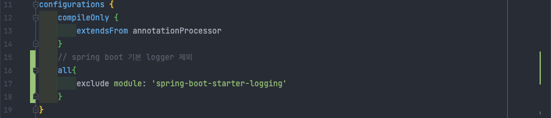

이번 시간에는 springboot 에서 log4j2를 설정해보겠습니다.

## 라이브러리 가져오기

---

### 기존 logging 라이브러리 제외하기

스프링에서 제공하는 기본 라이브러리는 사용하지 않을 예정이므로 제외시킵니다.

```gradle
    configurations {
        all{
            exclude module: 'spring-boot-starter-logging'
        }
}

```



### log4j2 라이브러리 가져오기

다음으로는 log4j2와 slf4j를 위한 라이브러리를 가져오겠습니다. slf4j는 slf4j-impl에 포함되어있으므로 따로 가져오진 않겠습니다. 버전은 작성일 기준 2.17.1 이상을 가져오시길 바랍니다. log4j 취약점 논란이 있었기 때문에 maven repository에서 가져오실 땐 꼭 취약점이 발견되지 않은 버전을 가져오시길 바랍니다.

`spring-boot-starter-log4j2` 를 통해 가져오지 않는 이유는 maven repository 사이트의 표기와 달리 2.17.0 버전을 가져오기 때문입니다.

```gradle
    dependencies { 
        implementation group: 'org.apache.logging.log4j', name: 'log4j-core', version: '2.17.2'
        implementation group: 'org.apache.logging.log4j', name: 'log4j-api', version: '2.17.2'
        implementation group: 'org.apache.logging.log4j', name: 'log4j-slf4j-impl', version: '2.17.2'
    }
```

### yml 설정을 위한 jackson-dataformat-yaml 라이브러리 가져오기

log4j2 설정을 .xml 로 관리해왔지만 이번 프로젝트는 .yml 로 관리해보도록 하겠습니다. .yml 으로 log4j2 설정을 관리하기 위해선 관련 라이브러리를 가져올 필요가 있습니다. 아래 라이브러리를 __dependencies__ 에 포함하도록 합니다.

```gradle
    implementation group: 'com.fasterxml.jackson.dataformat', name: 'jackson-dataformat-yaml', version: '2.13.1'
```


## log4j2.yml 생성 및 application.yml 설정

---

### application.yml 설정
log4j2 파일을 생성하기 전에 application.yml 에 생성할 파일의 경로를 정의합니다. 파일을 생성한 후에 정의해도 상관없습니다.

```yml
  logging:
    config: classpath:log4j2.yml
```

### log4j2.yml 파일 생성
log4j2.yml 파일을 생성합니다. 위치는 아래와 같습니다.

__src/main/resources/log4j2.yml__

### log4j2.yml 예시 (설명은 하단 참고)

생성한 파일에 예시 내용을 붙여넣습니다. 그대로 사용해도 상관없지만 본인의 상황에 맞게 커스텀하시길 바랍니다.

```yml
Configutation:
  name: Default
  status: warn

  Properties:
    Property:
    - name: "log-path"
      value: "./logs"
    - name: "pattern"
      value: "%highlight{[%-5level]} %d{yyyy-MM-dd HH:mm:ss.SSS} [%t][%F] %c{1} - %msg%n"
    - name: "charset-UTF-8"
      value: "UTF-8"

  Appenders:
    Console:
      name: Console_Appender
      target: SYSTEM_OUT
      PatternLayout:
        charset: ${charset-UTF-8}
        pattern: ${pattern}
        disableAnsi: false
    RollingFile:
      name: RollingFile_Appender
      fileName: ${log-path}/rollingfile.log
      filePattern: "logs/archive/rollingfile.log.%d{yyyy-MM-dd-hh-mm}_%i.gz"
      PatternLayout:
        charset: ${charset-UTF-8}
        pattern: ${pattern}
      Policies:
        SizeBasedTriggeringPolicy:
          size: "200KB"
        TimeBasedTriggeringPolicy:
          interval: "1"
      DefaultRollOverStrategy:
        max: "30"
        fileIndex: "max"
  Loggers:
    Root:
      level: debug
      AppenderRef:
        - ref: Console_Appender
        - ref: RollingFile_Appender
    Logger:
      name: example.demospringboot
      additivity: false
      level: debug
      AppenderRef:
        - ref: Console_Appender
        - ref: RollingFile_Appender
```

## log4j2.yml 설정 구조

---

### Configuration

로그를 설정하기 위한 최상위 태그입니다. 하위에는 다음과 같은 태그를 삽입할 수 있습니다.

|     항목     | 설명                                                                              |
|:----------:|:--------------------------------------------------------------------------------|
| Properties | 해당 파일에서 사용할 수 있는 공통 변수를 정의합니다. name, log layout pattern 등을 정의하는 것이 추후 관리에 편합니다. |
| Appenders  | 로그의 패턴과 저장 패턴 등을 설정할 수 있습니다.                                                    |
|  Loggers   | 출력하는 로그 범위를 지정할 수 있습니다. 설정에 따라 로그를 노출시키거나 생략할 수 있습니다.                           |

### Properties
```yaml
  Properties:
  Property:
    - name: "log-path"
      value: "./logs"
```

|  tag  | description                      |
|:-----:|:---------------------------------|
| name  | 호출할 때 사용할 수 있는 property 의 이름입니다. |
| value | 해당 property 를 호출했을 경우 실제 값입니다.   |

### Layout Pattern

로그에 표시될 정보와 순서를 정의할 수 있습니다. 각 태그에 대한 설명은 다음과 같습니다.

```yaml
    "%highlight{[%-5level]} %d{yyyy-MM-dd HH:mm:ss.SSS} [%t][%F] %c{1} - %msg%n"
```

|           Format            | description             |
|:---------------------------:|:------------------------|
|         %c, %logger         | 해당 로그를 쓰는 로거의 이름        |
|         %C, %Class          | 해당 로그를 요청한 클래스 이름       |
|          %d, %date          | 해당 로그가 발생한 시간           |
|       %enc, %encoding       | 특정 언어에서의 출력을 위한 문자 인코딩  |
| %ex, %exception, %throwable | 예외로그, 길이 설정이 가능         |
|          %F, %file          | 해당 로그가 발생한 클래스 파일명      |
|        %l, %location        | 해당 로그가 발생한 클래스명, 메소드명   |
|          %L, %line          | 해당 로그가 발생한 라인 번호        |
|     %m, %msg, %message      | 로그문에 전달된 메세지            |
|             %n              | 줄바꿈                     |
|         %p, %level          | 로그 레벨                   |
|        %r, %relative        | 로그 처리시간                 |
|         %t, %thread         | 해당 로그가 발생한 스레드 명        |
| %style{pattern}{ANSI style} | ANSI 를 사용하여 특정 패턴을 스타일링 | 
| %highlight{pattern}{style}  | 로그 레벨명을 ANSI 색으로 하이라이트  |

### logging level

지정한 로깅 레벨 이상의 로그만 출력 됩니다. __INFO__ 로 지정할 경우 DEBUG 와 TRACE 레벨의 로그는 생략됩니다. 

- FATAL
- ERROR
- WARN
- INFO
- DEBUG
- TRACE

### Appenders

|    name     | description                   |
|:-----------:|:------------------------------|
|   Console   | 콘솔창에 출력될 로그를 설정 합니다.          |
|    File     | 파일 형태로 저장될 로그를 설정합니다.         |
| RollingFile | 특정 트러거에 따라 파일로 백업할 로그를 설정합니다. |

```yaml
  Appenders:
    Console:
      name: Console_Appender
      target: SYSTEM_OUT
      PatternLayout:
        charset: ${charset-UTF-8}
        pattern: ${pattern}
        disableAnsi: false
```
- name: loggers 에서 호출할 이름을 정의합니다.
- target: 출력 방식입니다. Console 에서 사용됩니다.
- PatternLayout
    - charset: 인코딩 방식입니다.
    - pattern: 출력 레이아웃 방식입니다. 사용자 정의에 맞게 로그가 출력됩니다.
    - disableAnsi: 색상 변경 여부를 지정합니다. __true__ 일 경우 콘솔의 색이 변하지 않습니다.

패턴과 강조 색이 잘 반영되었다면 아래 화면과 같이 출력됩니다.


```yaml
    RollingFile:
      name: RollingFile_Appender
      fileName: ${log-path}/rollingfile.log
      filePattern: "logs/archive/rollingfile.log.%d{yyyy-MM-dd-hh-mm}_%i.gz"
      PatternLayout:
        charset: ${charset-UTF-8}
        pattern: ${pattern}
      Policies:
        SizeBasedTriggeringPolicy:
          size: "200KB"
        TimeBasedTriggeringPolicy:
          interval: "1"

```
- fileName: 파일이 저장될 경로와 파일명입니다.
- filePattern: 트리거에 따라 백업될 파일의 경로와 이름입니다. layout pattern 을 적용하여 파일 중복을 예방합니다.
- Policies: RollingFile appender 에서 지정할 트리거 항목입니다.
  - OnStartupTriggeringPolicy: jvm 을 시작할 경우 트리거가 발동합니다.
  - TimeBasedTriggeringPolicy: 특정 시간마다 트리거가 발동합니다. filePattern 에 지정한 단위로 롤링됩니다. (mm: 분 단위)
    - interval: 설정한 시간 간격마다 로그를 write 합니다. 기본값은 1입니다.
  - SizeBasedTriggeringPolicy: 파일 사이즈를 트리거로 지정합니다.
    - size: 설정한 파일의 용량을 초과할 경우 트리거가 발동합니다.
  - CronTriggeringPolicy: 크론 표현식을 기반으로 트리거가 발동합니다.
```yaml
  DefaultRollOverStrategy:
    max: "30"
    fileIndex: "max"
```
- DefaultRolloverStrategy: 날짜 패턴과 파일 패턴을 이용하여 파일을 저장합니다.
  - fileIndex: _max_ 로 지정할 경우 값이 높은 index 가 최신 파일이 됩니다.(내림차순) min 으로 지정할 경우 작은 index 가 최신 파일이 되며 기존 파일들을 rename 하는 방식입니다.(오름차순)
  - min: index count 의 최소값을 지정합니다. 기본값은 1 입니다.
  - max: index count 의 최대값을 지정합니다. 최대값에 도달할 경우 오래된 파일을 삭제합니다. 기본값은 7 입니다.
  - compressionLevel: 0~9까지의 정수값, 0은 압축하지않고, 1은 최고 속도, 9는 최고 압축 zip 파일만 가능합니다.
  - tempCompressedFilePattern: 압축하는 동안의 파일 이름 패턴입니다.

### Loggers


```yaml
  Loggers:
    Root:
      level: debug
      AppenderRef:
        - ref: Console_Appender
        - ref: RollingFile_Appender
    Logger:
      name: example.demospringboot
      additivity: false
      level: debug
      AppenderRef:
        - ref: Console_Appender
        - ref: RollingFile_Appender
```
- Root: 기본 설정값을 정의합니다. logger 에 따로 지정하지 않은 경우 __Root__ 규칙을 따릅니다. 필수로 설정해야 합니다.
  - level: 로그의 레벨을 지정합니다. 
  - AppenderRef: 해당 설정을 적용할 Appenders 를 지정합니다.
- Logger: Root 의 설정을 따르지 않는 logger 를 지정합니다.  하나 이상 설정할 수 있습니다.
  - name: 설정한 logger name 이 호출한 logger 으로 시작한다면 정의한 level 규칙을 따릅니다.
  - additivity: logger 중복 여부를 지정합니다. __false__ 로 지정할 경우 중복되지 않습니다.

## 테스트

---

### 테스트 코드 전문

```java
package org.acj.env;

import org.junit.jupiter.api.Test;
import org.slf4j.Logger;
import org.slf4j.LoggerFactory;

public class Log4j2Test {

    private final Logger logger = LoggerFactory.getLogger(this.getClass());

   @Test
   public void log4j2LoggerTest(){
       System.out.println("안녕 난 println이야");
       logger.info("안녕 난 logger야");
   }
}
```

### 결과


## 기타 참고

---

[apache_log4j2_configuration](https://logging.apache.org/log4j/2.x/manual/configuration.html)
[docs.spring.io-config yaml](https://docs.spring.io/spring-boot/docs/current/reference/html/features.html#features.external-config.yaml)

```toc
```