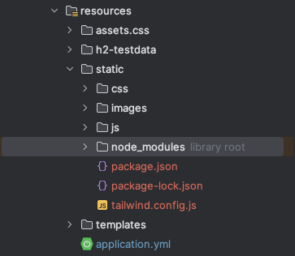
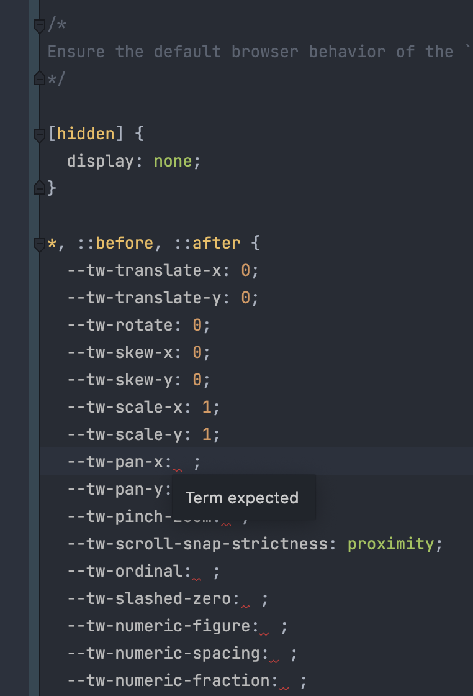

## 들어가면서
---
### npm 초보에게는 너무 어려워
Tailwindcss 공식 문서와 검색 자료들은 npm 이 아직 서투른 제가 bootstrap 에서 벗어나 tailwindcss 로 이동하기에는 자료도 적고 자세하지 않아서 이해하기 어려웠습니다. 대부분의 문서에서는 기본적인 지식을 전제로 글이 작성되었고, 반갑게 찾아본 자료들을 보며 표정이 굳어졌습니다...

그래서 많이 삽질했고 드디어 성공했는데, 혹시 다른 사람들에게 도움이 될까 싶어 간단히 글로 정리해봅니다. 해당 글에서는 npm 이 무엇인지, TailwindCSS 가 무엇인지에 대해서는 설명하지 않겠습니다.
### 목차
이번 글은 Springboot project 에서 tailwindcss 를 적용하는 내용을 담고 있습니다. 순서는 다음과 같습니다.
1. Springboot project 에 NPM 설정
2. Kotlin Gradle 에서 설정
3. tailwindcss 추가 및 설정
npm 과 TailwindCSS 가 무엇인지에 대해서는 설명하지 않는 점 참고 바랍니다.
### 구현 환경
| 종류  | 버전                    |
|:---:|-----------------------|
| OS  | M1 Mac(Ventura 13.5) |
| IDE | Intellij(2023.1.2)    |
| Java | jdk17 (temurin) |
| Spring | 2.7.5 |
| Gradle | 7.6.1 |
| node & npm | 18.17.1 & 0.6.7 |

## SpringBoot Project 에 NPM 설정
---
### npm 초기환경 설정
``` console
// npm 설정을 하고자하는 경로로 이동 EX
cd {중략}/src/main/resources/static

// package.json 파일 생성
npm init -y
```
성공한 경우 지정된 경로에 'package.json' 파일이 생성됩니다.
## Kotlin Gradle 설정
---
### Plugin id 추가
[com.github.node-gralde.node 최신 버전 확인](https://plugins.gradle.org/plugin/com.github.node-gradle.node)
위 사이트에서 plugin 의 적절한(최신) 버전을 확인한 후에 가져와서 다음과 같이 적용합니다.
``` gradle
// import 시 자동생성. gradle 설정이 모두 끝난 후 해당 import 가 제대로 되었는지 확인
import com.github.gradle.node.npm.task.NpmTask

plugins {
	id("com.github.node-gradle.node") version "4.0.0"
}

```
### node 설정
```
node{  
	version.set("18.17.1")  
	npmVersion.set("9.6.7")  
	download.set(true)  
	nodeProjectDir.set(file("${project.projectDir}/src/main/resources/static"))  
}
```
- version.set 은 node version 을 의미
- npmVersion.set 은 npm version 을 의미
### task 설정
```
val copyTask by tasks.registering(Copy::class) {  
    from(file("${project.projectDir}/front/build"))  
    into(file("${project.buildDir}/resources/main/static"))  
}  
  
tasks.bootJar{  
    dependsOn(copyTask)  
}
```
## TailwindCSS 추가 및 설정
---
### TawilwindCSS install
```
npm install -D tailwindcss
npx tailwindcss init
```
### tailwind.config.js 설정
```
/** @type {import('tailwindcss').Config} */  
module.exports = {  
  content: [  
      "../**/*.{html,js}"  
  ],  
  theme: {  
    extend: {  
    },  
  },  
  plugins: [],  
}
```
Content 는 적용하고자 하는 html, js 파일의 위치를 포함해야합니다. tailwindcss 에서 제공하는 예시와는 분명히 차이가 있으므로 무작정 복사하지 말고 본인의 프로젝트 경로와 비교해야합니다. 위 경로는 아래 프로젝트 구조에 해당하는 경로이므로 참고바랍니다.

### assets/css/style.css 파일 생성
경로에 제약은 없으나 예시와 다른 경로에 파일을 생성할 경우 아래 빌드 스크립트 작성시 경로 수정이 필요합니다. 파일 생성후에는 다음과 같은 내용을 삽입합니다.
```
@tailwind base; @tailwind components; @tailwind utilities;
```
### Build Scripts 추가
필요할때마다 매번 타이핑해서 실행해도 되지만 기억에만 의존할 수 없으니 script 를 한번 작성해서 두고두고 쓸 수 있도록 합니다.
'package.json' 파일을 열어 아래와 같이 스크립트를 추가합니다.
```
"scripts": {  
  "build-css": "npx tailwindcss -i ../assets/css/style.css -o ./css/style.tailwind.css --watch"  
},
```
- ../ssets/css/style.css 는 불러올 style 파일의 경로입니다. 이전에 파일 경로를 변경했다면 이 역시 맞춰서 변경해줘야합니다.
- ./css/style.tailwind.css 는 script 결과로 생성될 파일 경로와 위치입니다. 해당 파일을 html 에서 가져오게 됩니다.
### html (With Thymeleaf)에서 tailwindcss 파일 가져오기
``` html
<head>
	<link th:href="@{./css/style.tailwind.css}" rel="stylesheet">
</head>
```
순수 html 에서 가져오는 방법을 사용해도 되지만 thymeleaf 를 사용하는 경우에는 다음과 같이 가져올 수 잇도록 합니다.
## 번외
---
### intellij 환경에서 style.tailwind.css 에 뜨는 경고 문구 해결하기

build 로 생성된 style.tailwind.css 에 마치 오류가 있는 것 처럼 빨간 줄이 뜨고, 문제가 발생한 곳으로 이동하면 다음과 같은 에러 문구를 확인할 수 있습니다. 검색해본 결과 다음과 같은 방법으로 해결 할 수 있습니다.
- 추가된 이슈목록과 제시된 해결 방법
	1. 경고 문구 무시 하기
	2. 23.1.2 이상의 최신 버전으로 업데이트 하기
제 개인적인 의견이지만 따로 설정을 바꾸는 것 보다는 최신 버전으로 업데이트 하는 것이 더 나은 방법이라고 생각합니다. 필자는 23.2 버전으로 업데이트하여 파일 아래의 빨간 줄과 'Term expected' 오류가 없어진 것은 확인했지만 다른 종류의 오류와 경고줄은 사리지지 않았으니 참고 바랍니다. 그래도 파일 자체에 있던 빨간 줄이 사라져서 따로 들어가보지 않는 이상 거슬릴 일은 줄었으니 다행이네요.
## 마무리
---
### 참 다사다난 했던 적용기
지금 보면 너무나도 쉬운 설정이지만 잘 모르는 상황에서는 뭐가 문제인지 몰라 한참 헤맸던 적용기입니다.
저 같은 초보자를 위한 How to guide 가 있었으면 더 쉬웠겠지만 뭔가 단편적인 설명들만 있었을 뿐 spring 환경에서 A to Z 로 알려주는 자료는 거의 없었던 것 같아서 참 아쉽습니다. 부족하지만 혹시 저 같은 사람들이 이 글을 보고 도움이 되었으면 하는 바람입니다.
```toc
```