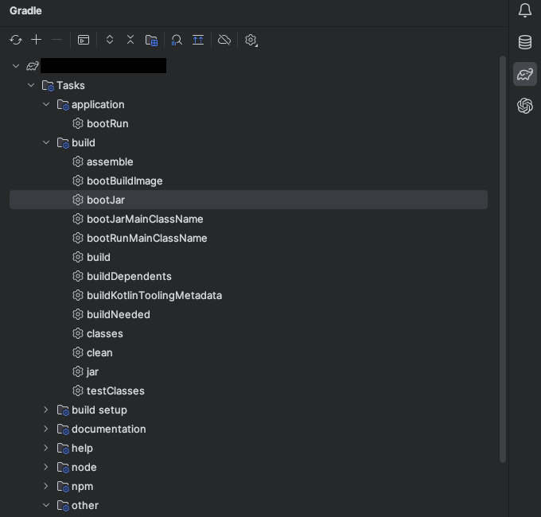
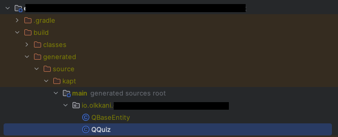

Kotlin SpringBoot 환경에서 QueryDSL 을 설정고자 했으나 제대로 성공한 케이스가 없어 진땀 뺀 기억이 있습니다. 해당 포스트에서는 제가 적용 한 kotlin spring boot 에서 QueryDSL 을 공유하고자 하며 이미 Spring Data JPA 환경이 구축된 상태를 전제로 합니다.

추가로 해당 포스트는 아직 다듬어지지 않은 상태이므로 추후 피드백에 따라 수정될 여지가 있습니다. :)

### 구현 환경
| 종류  | 버전                    |
|:---:|-----------------------|
| OS  | M1 Mac(Monterey 12.4) |
| IDE | Intellij(2022.1.2)    |
| Java | jdk17 (temurin) |
| Spring | 2.7.5 |
| Gradle | 7.6.1 |
정확한 이유는 파악 중이지만 kotlin plugin 버전을 높일 경우 제대로 적용되지 않는 문제가 있습니다. 1.6.10 에서는 문제 없이 동작하는 것을 확인했으므로 본인 환경에 따라 적용하면 될 것 같습니다.

## 환경 설정
---
### build.gradle.kts 설정 추가
해당 파일의 전문은 하단에 있습니다.
```
dependencies{
	implementation("com.querydsl:querydsl-jpa:5.0.0")
	implementation("com.querydsl:querydsl-apt:5.0.0")   
	implementation("javax.persistence:javax.persistence-api:2.2") 
	kapt("com.querydsl:querydsl-apt:5.0.0:jpa")
	annotationProcessor("jakarta.persistence:jakarta.persistence-api:3.1.0") 
	annotationProcessor("jakarta.persistence:jakarta.annotation-api:3.1.0") 
	annotationProcessor(group = "com.querydsl", name = "querydsl-apt", classifier = "jpa")
	
}

// Kotlin QClass Setting 
kotlin.sourceSets.main { 
	println("kotlin sourceSets builDir:: $buildDir") 
	setBuildDir("$buildDir") 
} 	
	
idea { 
	module { val kaptMain = file("build/generated/source/kapt/main") 
	sourceDirs.add(kaptMain) 
	generatedSourceDirs.add(kaptMain) } }
}
```
### QuerdslConfiguration
```
package io.olkkani.study.config.jpa 

import com.querydsl.jpa.impl.JPAQueryFactory 
import org.springframework.context.annotation.Bean 
import org.springframework.context.annotation.Configuration 
import javax.persistence.EntityManager 
import javax.persistence.PersistenceContext 

@Configuration 
class QuerydslConfiguration ( 
	@PersistenceContext 
	private val entityManager: EntityManager 
) { 
	@Bean fun jpaQueryFactory(): JPAQueryFactory = JPAQueryFactory(entityManager) }

```
import 에러가 발생한다면 EntityManager 와 PersistenceContext 를 제대로 import 했는지 확인해야합니다.
## 적용 예제
---
### QClass 생성하기
환경 설정을 모두 마무리 했다면 QClass 를 생성합니다.
다음과 같이 좌측 탭에서 'bootJar' 을 더블클릭하여 qclass 를 생성합니다.


성공한 경우 다음과 같은 경로에 qclass 가 새롭게 생성됩니다.



### QuizRepositorySupport
환경설정이 모두 완료한 후 qquiz 를 생성했다면 다음 예제와 같이 사용할 수 있습니다.
```
package io.olkkani.study.domain

import com.querydsl.core.types.dsl.NumberExpression
import com.querydsl.jpa.impl.JPAQueryFactory
import io.olkkani.study.domain.QQuiz.quiz
import org.springframework.data.jpa.repository.support.QuerydslRepositorySupport
import org.springframework.stereotype.Repository

@Repository
class QuizRepositorySupport(
    private val queryFactory: JPAQueryFactory
) : QuerydslRepositorySupport(
    Quiz::class.java
){

    fun getRandomQuiz(): List<Quiz>? =
        queryFactory.selectFrom(quiz)
            .orderBy(NumberExpression.random().asc())
            .limit(10).fetch()
}
```
## 마무리 지으며
---
이상으로 Kotlin Spring Boot 환경에서 QueryDSL 을 설정하는 방법을 마치겠습니다. 아직 모르는 부분도 많고 파악 중인 부분도 많아서 부족하지만 처음 설정하시는 분들에게 참고가되었으면 하는 바람에 포스팅합니다.

## 참고 및 출처
---
### Build.Gradle.kts 전문
``` 
import org.jetbrains.kotlin.gradle.tasks.KotlinCompile

  

plugins {

id("org.springframework.boot") version "2.7.5"

id("io.spring.dependency-management") version "1.1.0"

  

id("org.jetbrains.kotlin.jvm") version "1.6.10"

id("org.jetbrains.kotlin.plugin.spring") version "1.6.10"

id("org.jetbrains.kotlin.plugin.jpa") version "1.6.10"

id("org.jetbrains.kotlin.kapt") version "1.6.10"

  

idea

}

  

group = "io.olkkani"

version = "0.0.1-SNAPSHOT"

java.sourceCompatibility = JavaVersion.VERSION_17

  

repositories {

mavenCentral()

}

configurations {

all {

// was tomcat 제외

exclude(module = "spring-boot-starter-tomcat")

// not necessary test lib delete

exclude(module = "org.hamcrest")

}

}

dependencies {

// kotlin

implementation("org.jetbrains.kotlin:kotlin-reflect")

implementation("org.jetbrains.kotlin:kotlin-stdlib-jdk8")

implementation("com.fasterxml.jackson.module:jackson-module-kotlin")

// common

implementation("org.apache.commons:commons-text:1.10.0")

implementation("org.apache.commons:commons-lang3:3.12.0")

implementation("commons-io:commons-io:2.11.0")

implementation("io.github.microutils:kotlin-logging-jvm:3.0.5")

// spring

implementation("org.springframework.boot:spring-boot-starter-web")

developmentOnly("org.springframework.boot:spring-boot-devtools")

annotationProcessor("org.springframework.boot:spring-boot-configuration-processor")

// was

implementation("org.springframework.boot:spring-boot-starter-undertow")

// database, jdbc

runtimeOnly("com.h2database:h2:2.1.214")

testRuntimeOnly("com.h2database:h2:2.1.214")

implementation("org.springframework.boot:spring-boot-starter-data-jpa")

  

// annotationProcessor("com.querydsl:querydsl-apt:${dependencyManagement.importedProperties['querydsl.version']}:jpa")

// annotationProcessor("com.querydsl:querydsl-apt:5.0.0:jpa")

implementation("com.querydsl:querydsl-jpa:5.0.0")

implementation("com.querydsl:querydsl-apt:5.0.0")

implementation("javax.persistence:javax.persistence-api:2.2")

  

kapt("com.querydsl:querydsl-apt:5.0.0:jpa")

  

annotationProcessor("jakarta.persistence:jakarta.persistence-api:3.1.0")

annotationProcessor("jakarta.persistence:jakarta.annotation-api:3.1.0")

annotationProcessor(group = "com.querydsl", name = "querydsl-apt", classifier = "jpa")

  

// view template

implementation("org.springframework.boot:spring-boot-starter-thymeleaf")

implementation("nz.net.ultraq.thymeleaf:thymeleaf-layout-dialect:3.2.0")

// test

testImplementation("org.springframework.boot:spring-boot-starter-test")

testImplementation("com.ninja-squad:springmockk:4.0.0")

  

kapt("org.springframework.boot:spring-boot-configuration-processor")

}

  

tasks.withType<KotlinCompile> {

kotlinOptions {

freeCompilerArgs = listOf("-Xjsr305=strict")

jvmTarget = "17"

}

}

  

tasks.withType<Test> {

useJUnitPlatform()

}

  

tasks.getByName<Jar>("jar") {

enabled = false

}

  

// Kotlin QClass Setting

kotlin.sourceSets.main {

println("kotlin sourceSets builDir:: $buildDir")

setBuildDir("$buildDir")

}

  

// legacy Kotlin QClass Setting (deprecated gradle version 7.x)

//sourceSets["main"].withConvention(org.jetbrains.kotlin.gradle.plugin.KotlinSourceSet::class){

// kotlin.srcDir("$buildDir/generated/source/kapt/main")

//}

  

// querydsl 추가

  

idea {

module {

val kaptMain = file("build/generated/source/kapt/main")

sourceDirs.add(kaptMain)

generatedSourceDirs.add(kaptMain)

}

}
```
[https://pasudo123.tistory.com/472](https://pasudo123.tistory.com/472)