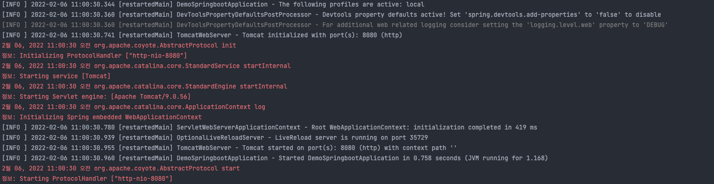
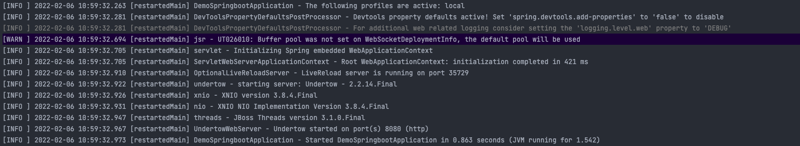

## 들어가기에 앞서

---

### Undertow 란?

Undertow 란 bloking/non-blo 작업 모두에 사용할 수 있도록 설계된 웹 서버입니다.

### Tomcat 대신 Undertow 로 바꿔야 하는 이유

아주 오랜시간동안 Tomcat 이 쓰여 익숙하지만, 단지 그 이유 하나만으로 Tocmat 을 써야하는 것은 나쁘다고 생각합니다.

여러 벤치마크 결과에 따르면 Undertow 는 Tomcat 보다 더 빠르고 가볍고 안정적이고 더 많은 부하를 처리할 수 있습니다.
관련 커뮤니티도 잘 갖춰져 있기 때문에 제약이 크지 않다면 Tomcat 보다는 Undertow 를 사용하는 것이 더 합리적이라고 생각합니다.

### 적용 환경

| 항목        | 버전         |
||------------|||-----------| |
| build tool | gradle 7.3.2 |
| application config | application.yml |

## 내장 WAS 를 Undertow 로 변경하기

---

### 기존 WAS 인 Tomcat 을 제외

Tomcat은 사용하지 않을 예정이므로 제외합니다.
제외하지 않을 경우 에러가 발생할 수 있으니 꼭 제외할 수 있도록 합니다.

의존성 관리는 build.gradle 에서 할 수 있습니다.
```yaml
configurations {
    all{
        // was tomcat 제외
        exclude module: 'spring-boot-starter-tomcat'
    }
}
```

### Undertow 의존성 추가

```yaml
dependencies {
    implementation group: 'org.springframework.boot', name: 'spring-boot-starter-undertow', version: '2.6.3'
}
```

## Undertow 설정 추가

기본값이 정해져 있지만 필요에 따라 Undertow 설정을 추가합니다. 설정은 application.yml 에서 할 수 있습니다.

```yaml

spring:
    server:
      port: 8080
```

## 결과 확인

---

정상적으로 바뀌었는지 확인하기 위해서는 서버를 기동하고 로그를 확인해봅니다.

### 기존 Tomcat 환경



### undertow 환경




## 참고 및 출처
---
(Undertow-docs)[https://undertow.io/undertow-docs/undertow-docs-2.1.0/index.html]

(spring-boot-performacne-benchmarks)[https://dev.to/azure/spring-boot-performance-benchmarks-with-tomcat-undertow-and-webflux-4d8k]
```toc
```
